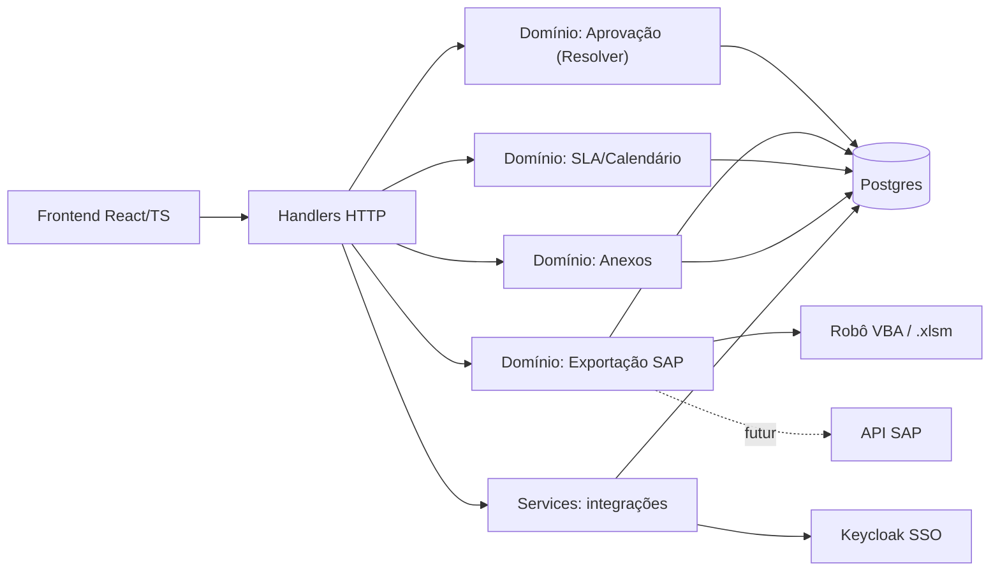
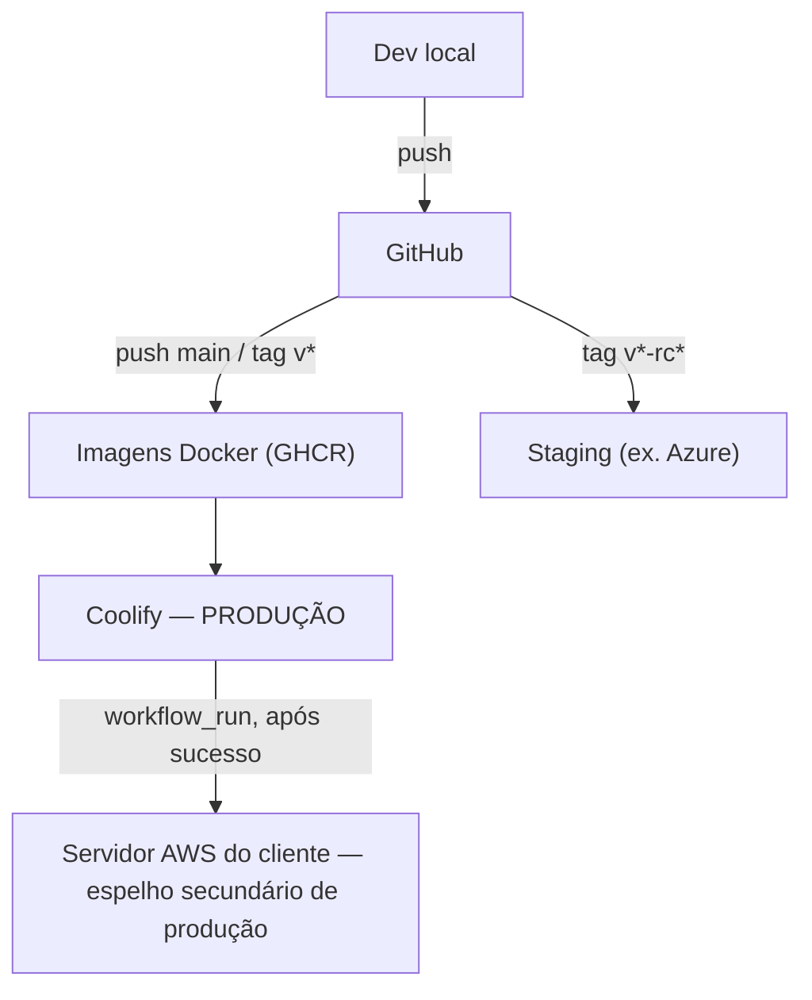
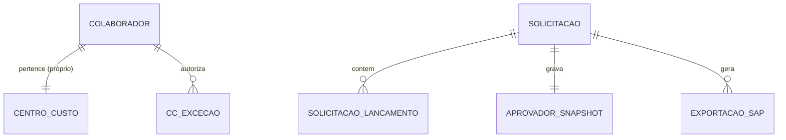

# Architecture Spine — FB_APU05 — Módulo Controladoria

## Design Paradigm

Dois regimes coexistem, por decisão explícita (motor de aprovação e exportação SAP são o maior risco de esforço do produto — PRD §5.3):

- **Núcleo de domínio isolado** (`backend/internal/aprovacao`, `backend/internal/exportacao`): sem dependência de `net/http` nem de driver de banco específico na superfície pública da interface. Única porta de entrada para as regras que os 5 tipos de solicitação compartilham.
- **Handler Factory simples** (`backend/handlers`, `backend/services`, `backend/migrations`): padrão já validado em produção no FB_APU02 para tudo que não é o núcleo de risco — cadastros, fila do administrador, autenticação.

## Invariants & Rules

### AD-1 — Paradigma híbrido

- **Binds:** `all`
- **Prevents:** lógica de aprovação ou de exportação reimplementada de forma divergente a cada novo tipo de solicitação ou endpoint.
- **Rule:** handlers e services nunca calculam aprovador nem geram arquivo de exportação diretamente — sempre delegam ao módulo de domínio correspondente (AD-2, AD-3). Handlers de Painéis (4.8) leem exclusivamente de `painel_snapshots` — nunca agregam direto das tabelas transacionais.

### AD-2 — Motor de aprovação por porta única

- **Binds:** FR-5, FR-6, FR-7, FR-8, FR-9, FR-10, FR-11
- **Prevents:** cada um dos 5 tipos de solicitação implementar sua própria variação da regra de alçada, reimplementar o dispatch tipo→resolver, ou modelar o retorno do aprovador de formas incompatíveis entre si.
- **Rule:** interface `Resolver` com duas implementações (`ResolverCalculado`, `AutorizadorNominal`). Dispatch tipo→resolver vive numa única função/fábrica compartilhada (`ResolverParaTipo(tipo) Resolver`) — nenhum dos 5 handlers reimplementa esse mapeamento. Todo handler chama apenas `Resolver.Resolve(solicitacao) → (Aprovador, error)`. `Aprovador` é um tipo único e explícito, nunca string livre: `{Tipo: "pessoa"|"cargo", Nome string, ColaboradorID *string, Motivo string, RegraID string, RegraVersao int}` — `ColaboradorID` é nulo exatamente quando `Tipo="cargo"` (ex.: papel colegiado sem titular). Quando não há alçada cadastrada acima da janela do gerente, `Resolve` retorna um erro sentinela explícito (`ErrSemAlcadaCadastrada`, carregando CC e filial) — a função **nunca** sintetiza um `Aprovador` fictício para preencher a lacuna; é o chamador que traduz esse erro em "sem alçada cadastrada" para o usuário.

### AD-3 — Exportação SAP por porta única

- **Binds:** FR-15
- **Prevents:** Lote-Despesa e Lote-Obra divergirem em como validam elegibilidade ou gravam snapshot; a troca futura pelo robô VBA → API SAP exigir reescrever os chamadores; dois handlers escolherem granularidade ou dono de escrita diferentes para o mesmo lote.
- **Rule:** interface `ExportadorSAP` com métodos `GerarLoteDespesa(solicitacaoIDs []string) (Lote, error)` / `GerarLoteObra(solicitacaoIDs []string) (Lote, error)` — sempre por lote (nunca por solicitação individual). `Lote` inclui `LoteID string` e `ArquivoBytes []byte`. A própria implementação de `ExportadorSAP` grava `exportacoes_sap` (não o handler — reforça AD-4); handlers apenas chamam o método e devolvem o `ArquivoBytes` ao navegador. v1 implementa `ExportadorVBA`; a troca futura é uma nova implementação (`ExportadorAPI`) da mesma interface, sem mudar handlers nem domínio de aprovação.

### AD-4 — Writer path único para decisão e exportação

- **Binds:** FR-10, FR-11, FR-15
- **Prevents:** um handler gravar `aprovador_snapshot`, `versao` ou status de `exportacoes_sap` por SQL direto, divergindo do que o módulo de domínio decidiu — inclusive por descuido futuro, não só por desenho inicial (o FB_APU02 já documenta esse exato anti-padrão com RLS declarado e não aplicado).
- **Rule:** toda escrita nesses campos passa exclusivamente pelos módulos `aprovacao`/`exportacao`; proibido UPDATE direto desses campos fora deles. Backstop técnico, não só convenção de code review: `REVOKE UPDATE (aprovador_snapshot, versao, status, exportacoes_sap.*) ON solicitacoes, exportacoes_sap FROM app_role_padrao`; a conexão de banco usada pelos módulos `aprovacao`/`exportacao` usa uma role própria com o `GRANT` necessário.

### AD-5 — Lock otimista

- **Binds:** FR-12, FR-13, FR-14, FR-15
- **Prevents:** duas ações concorrentes (dois admins, ou admin + solicitante) sobrescreverem uma solicitação silenciosamente; handlers devolvendo envelopes de erro 409 incompatíveis entre si. Vale também para a transição de status feita pela exportação SAP (AD-3/AD-4) — é a mesma linha de `solicitacoes`, o mesmo lock.
- **Rule:** toda escrita em `solicitacoes` usa `WHERE versao = :versao_lida`; zero linhas afetadas retorna HTTP 409, sem retry automático no servidor, sempre no envelope `{"erro": {"codigo": "conflito_versao", "mensagem": string, "versao_atual": int}}`.

### AD-6 — Autenticação via Keycloak `[ADOPTED]`

- **Binds:** FR-1, FR-2
- **Prevents:** um fluxo de login/validação de token divergente do já corrigido em produção no FB_APU02 (ex.: esquecer a checagem de `email_verified`, achado de segurança documentado lá).
- **Rule:** replica o fluxo já validado em produção no FB_APU02 — OIDC/PKCE contra `https://iam.fcxlabs.com/realms/ferreiracosta`, validação via JWKS, checagem obrigatória de `email_verified`. Perfil e ator sempre da sessão, nunca do payload.

### AD-7 — Autorização single-company `[AMENDED]`

- **Binds:** `all`, FR-2
- **Prevents:** introdução desnecessária de campo/filtro `company_id` ou lógica de multitenancy copiada do FB_APU02, divergindo do fato de que o FB_APU05 serve uma única empresa; dois caminhos de código decidindo "quem é admin" de formas diferentes (ex. um lendo claim do Keycloak, outro lendo a tabela de usuários), causando autorização divergente silenciosa.
- **Rule:** sem `company_id`/multitenancy (diferente do FB_APU02). Perfil (`solicitante`/`administrador`) é uma coluna gerenciada pela própria aplicação (tabela `usuarios`, mesmo padrão do `users.role` já validado no FB_APU02) — **não** deriva de role/claim do Keycloak. Identidade (qual usuário é) vem do Keycloak (e-mail verificado); autorização (o que esse usuário pode fazer) vem do nosso banco. Concessão de perfil administrador é uma escrita nessa coluna, feita por um módulo único que também aplica a proteção do último admin (FR-2) — nunca só na UI, nunca via chamada à Admin API do Keycloak (que não está no escopo deste projeto). Correção registrada em 2026-10-06 durante a investigação da Story 1.2: a versão original deste AD (derivar perfil de `resource_access.<client>.roles`) era incompatível com FR-2, que exige que o próprio sistema seja capaz de conceder/revogar perfil e proteger o último admin — algo que uma claim do Keycloak, somente legível, não permite.

### AD-8 — Carga da base Senior via upload manual

- **Binds:** FR-3
- **Prevents:** acesso direto a banco/view externo da Senior nesta fase (fora de escopo — ver Deferred); confusão entre o CC **próprio** (vindo da Senior) e o CC de **exceção** (cadastro interno).
- **Rule:** endpoint de upload de CSV (UTF-8 BOM, separador `;`), acionado manualmente por um administrador — nunca job agendado nem leitura direta de outro banco. Escopo estrito: só escreve o CC próprio do colaborador. `CC_EXCECAO` (FR-4) nunca é escrito por essa carga — é um cadastro administrável à parte, governado pelo mesmo regime de FR-16 (4.7).

### AD-9 — Stack herdado `[ADOPTED]`

- **Binds:** `all`
- **Prevents:** divergência de versões entre os dois sistemas irmãos, que fragmentaria conhecimento operacional e padrões de segurança já validados; reinvenção dos middlewares de segurança HTTP que o FB_APU02 já corrigiu em produção.
- **Rule:** versões idênticas às do FB_APU02 em produção ativa (verificado por inspeção direta do sistema irmão, commit mais recente 2026-10-05; Go 1.22 é débito técnico conhecido e **compartilhado** entre os dois sistemas — fora da janela de suporte upstream, qualquer atualização futura deve ser avaliada para os dois ao mesmo tempo) — ver tabela Stack. Inclui também os middlewares de segurança HTTP já validados: `SecurityMiddleware` global (HSTS, CSP, X-Frame-Options DENY, nosniff, Referrer-Policy, Permissions-Policy), rate limiting por IP em endpoints sensíveis, CORS por whitelist (`ALLOWED_ORIGINS`), e emissão/rotação de JWT próprio (access 30min + refresh 7 dias em cookie HttpOnly/SameSite=Strict, blacklist no logout).

### AD-10 — Deploy `[ADOPTED]`

- **Binds:** `all`
- **Prevents:** um segundo pipeline de deploy divergente do FB_APU02, multiplicando superfície operacional para a mesma equipe de infraestrutura; confundir qual ambiente é produção.
- **Rule:** replica a topologia real do FB_APU02, não só a ideia de pipeline — **Coolify é produção** (Docker + Traefik, domínio próprio do FB_APU05); **staging/homologação roda em ambiente separado (ex. Azure), disparado por tags `v*-rc*`**; o servidor AWS do cliente é um **espelho secundário de produção**, encadeado via `workflow_run` depois do deploy no Coolify ter sucesso — nunca um ambiente de teste. GitHub Actions testa, builda imagens (GHCR) e publica nos três alvos conforme o gatilho (push em `main`/tag `v*` → Coolify + AWS; tag `v*-rc*` → staging). Todo ambiente expõe `/api/health`, checado com retry pós-deploy antes de considerar o deploy bem-sucedido.

### AD-11 — Motor de SLA/calendário de negócio

- **Binds:** FR-12, FR-13, FR-14, FR-17
- **Prevents:** Fila do Administrador e Painéis calculando "está atrasado?" de formas diferentes, ou um dos dois ignorando o calendário de feriados editável (FR-16).
- **Rule:** módulo único (`backend/internal/sla`) expõe `EstaAtrasado(solicitacao) bool` e `PrazoLimite(solicitacao) time.Time`, calculado contra o calendário de feriados PE/federais (FR-16) em fuso `America/Recife`, 48h úteis. Fila do Administrador e Painéis consomem esse módulo — nenhum dos dois recalcula o calendário por conta própria. A regra de pausa do SLA (PRD Questão Aberta 10) fica fora deste AD até o negócio decidir — ver Deferred.

### AD-12 — Geração do arquivo `.xlsm`

- **Binds:** FR-15
- **Prevents:** reintroduzir, na nova stack (Go), os mesmos bugs já documentados e corrigidos no gerador legado (JS/VBA) — corrupção de fórmula, `calcChain` desatualizado, aba oculta.
- **Rule:** `ExportadorVBA` manipula o `.xlsm` como arquivo ZIP/XML via `archive/zip` + reescrita de partes XML (sem biblioteca externa de OOXML, mesma técnica do gerador legado). Nunca toca o part `vbaProject.bin` — copiado byte a byte. Todo texto livre do usuário (título, descrição) passa por função de escape antes de entrar em qualquer fórmula ou texto gerado — nunca por substituição de string não-escapada. Remove `xl/calcChain.xml` sempre que reescrever linhas. Mantém a aba de rascunho (`SAP Export` ou equivalente) sempre `Visible`, nunca `veryHidden`.

### AD-13 — Anexos: upload por módulo único

- **Binds:** FR-8 e demais tipos de solicitação que aceitam anexo
- **Prevents:** cada um dos 5 handlers de solicitação implementar sua própria convenção de upload/storage/metadado para `solicitacao_anexos`.
- **Rule:** módulo único (`backend/internal/anexos`) expõe `Salvar(arquivo) (AnexoRef, error)` e `Recuperar(id) (io.Reader, error)`; todo handler que aceita anexo (ex. FR-8) chama exclusivamente esse módulo. Metadado + hash por arquivo (padrão já definido no PRD); antivírus/DLP/quarentena permanece em aberto (Deferred, PRD Questão Aberta 3) — mas o mecanismo base de storage não.

### AD-14 — Paginação obrigatória

- **Binds:** `all`
- **Prevents:** um endpoint de listagem nova (ex. `/alcadas`, hoje 7.683 faixas ativas) devolver a lista inteira de uma vez, ou usar nomes de parâmetro diferentes dos demais endpoints.
- **Rule:** toda listagem usa os parâmetros de query `pagina` e `tamanho` (1–100) e responde `{items, pagina, tamanho}` — sem `total` nem cursor (PRD §5.2). Essa convenção vale para listas transacionais paginadas; **painéis agregados (4.8)** respondem num formato diferente (valores pré-calculados de `painel_snapshots`, não uma lista paginável) — os dois formatos não devem ser confundidos.

### Direção de dependência



## Consistency Conventions

| Concern | Convention |
| --- | --- |
| Naming (entidades, interfaces) | Interfaces e tipos do domínio usam os termos do Glossário do PRD em português (`Resolver`, `Aprovador`, `SnapshotAprovacao`, `ExportadorSAP`); camada HTTP/infra segue convenção Go padrão. `tipo_solicitacao` usa exatamente os valores do Glossário (`transferencia`, `inclusao`, `inclusao_sfc`, `imobilizado`, `obras`). |
| Data & formatos | UUID (`gen_random_uuid()`) como PK; `created_at`/`updated_at` em toda tabela; listas retornam `{items, pagina, tamanho}` — sem `total` nem cursor (AD-14); painéis agregados respondem em formato próprio, não paginado (AD-14); conflito de versão = HTTP 409 no envelope `{"erro": {...}}` (AD-5). |
| State & cross-cutting | Mutação concorrente via lock otimista (AD-5); autenticação via sessão Keycloak (AD-6, AD-7); migrations SQL puro, numeradas `NNN_nome.sql`, auto-executadas no boot via tabela `schema_migrations` (padrão FB_APU02). |
| Dados sensíveis | Nomes reais, matrículas e valores de alçada nominal de pessoas nunca aparecem em código, specs, stories ou qualquer artefato deste repositório — sempre referenciar por cargo/papel. Herdado do PRD/addendum; o repositório é público. |

## Stack

| Name | Version |
| --- | --- |
| Go | 1.22 (débito técnico compartilhado com FB_APU02 — fora da janela de suporte upstream, ver AD-9) |
| PostgreSQL | 15 |
| `github.com/lib/pq` | v1.11.2 |
| golang-jwt | v5.3.1 |
| bcrypt | custo 14 |
| React | 18.3.1 |
| TypeScript | 5.2.2 |
| Vite | 5.2 |
| Tailwind CSS + shadcn/ui | 3.4.x |
| React Router DOM | 6.22.3 |
| TanStack Query | 5.90 |
| React Hook Form + Zod | 7.71 + 4.3.6 |
| Recharts | — (gráficos) |
| Sonner | — (toasts) |
| `xlsx` (frontend) | — (export Excel auxiliar; geração do `.xlsm` em si é backend, ver AD-12) |
| Docker + Coolify + Traefik | — (infra, não versionada por código) |

## Structural Seed

### Deployment & Environments



### Entidades centrais (nomes + relações)



### Árvore de diretórios (herdada do FB_APU02)

```text
FB_APU05/
  backend/
    main.go
    internal/
      aprovacao/     # Resolver, ResolverCalculado, AutorizadorNominal (AD-2)
      exportacao/     # ExportadorSAP, ExportadorVBA (AD-3)
    handlers/          # 1 arquivo por domínio HTTP
    services/          # integrações (Keycloak, upload Senior)
    middleware/
    migrations/        # NNN_nome.sql
  frontend/
    src/
      pages/
      components/ui/
      contexts/
      hooks/
      lib/
  docker-compose.yml
  docker-compose.prod.yml
  .github/workflows/
```

## Capability → Architecture Map

| Capability / Área (PRD) | Vive em | Governado por |
| --- | --- | --- |
| 4.1 Autenticação e Identidade | `backend/services`, `backend/middleware` | AD-6, AD-7 |
| 4.2 Identidade de Solicitante e CC — FR-3 (carga Senior) | `backend/handlers`, upload CSV | AD-8 |
| 4.2 Identidade de Solicitante e CC — FR-4 (exceções de CC) | `backend/handlers` (padrão Handler Factory) | AD-1 (regime simples), mesmo padrão de 4.7 |
| 4.3 Solicitações — os 5 Tipos | `backend/handlers` (1 por tipo) | AD-1, AD-2, AD-13 (anexos) |
| 4.4 Motor de Aprovação | `backend/internal/aprovacao` | AD-2, AD-4 |
| 4.5 Fila do Administrador | `backend/handlers`, `backend/internal/sla` | AD-5, AD-11 |
| 4.6 Exportação SAP | `backend/internal/exportacao` | AD-3, AD-4, AD-12 |
| 4.7 Cadastros Administráveis | `backend/handlers` (padrão Handler Factory) | AD-1 (regime simples) |
| 4.8 Painéis e Indicadores | `backend/handlers` (leitura de snapshots) | AD-1 (leitura read-only), AD-11 (SLA), AD-14 (formato não-paginado) — escopo de indicadores a definir, PRD §7.3 |

## Deferred

- Repositório de anexos: antivírus/DLP, quarentena (PRD Questão Aberta 3) — o mecanismo base de storage já está decidido (AD-13).
- Domínio, proxy, observabilidade, SLA técnico de cada ambiente (PRD Questão Aberta 4) — a topologia de ambientes em si já está decidida (AD-10); o que falta é configuração fina, não arquitetura.
- Estratégia de rollback de aplicação e banco (PRD Questão Aberta 5).
- HA, backup e restore do Postgres de produção (PRD Questão Aberta 6).
- Client/realm exato de provisionamento no Keycloak para este módulo — reaproveitar o client do FB_APU02 ou criar um próprio (PRD Questão Aberta 2). Perfil não depende dessa decisão (AD-7 já fixa que vem da tabela `usuarios`, não de claim do Keycloak) — falta só a identidade/provisionamento do client em si.
- Formato final da API SAP — dependência externa de outro time, forma ainda desconhecida; `ExportadorAPI` (AD-3) só pode ser desenhado em detalhe quando o contrato existir.
- Cadência de recarga da base Senior (PRD Questão Aberta 1) — AD-8 fixa o mecanismo (upload manual), não a frequência.
- Regra de pausa do SLA (PRD Questão Aberta 10) — AD-11 fixa onde o cálculo mora, não a regra de negócio da pausa em si.
- Especificação de origem nunca passou por UAT autenticada nem aceite formal de negócio (PRD Questão Aberta 13) — risco de primeira ordem que pode invalidar premissas deste spine; não é decisão de arquitetura, mas condiciona a confiança em todas as outras.
